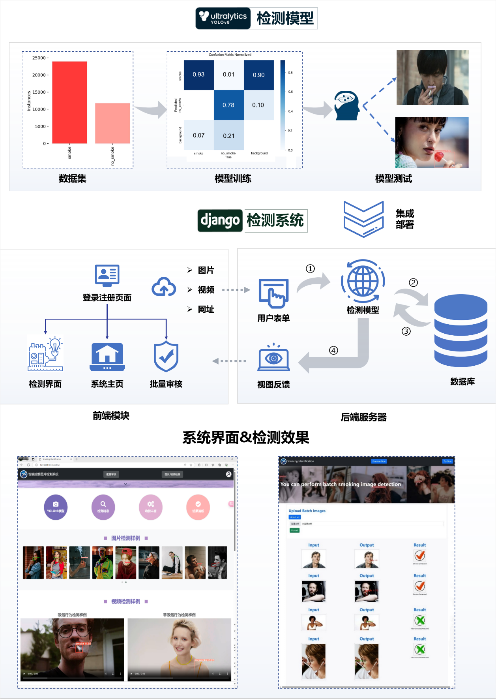

# 智能吸烟检测系统
基于YOLOv8和Django的智能吸烟行为检测系统

本项目是一个基于计算机视觉的吸烟行为检测系统，使用YOLOv8深度学习模型进行吸烟行为的实时检测，并通过Django框架提供Web界面。

## 系统功能

- **吸烟行为检测**: 检测图片或视频中是否存在吸烟行为
- **实时检测**: 支持实时视频流中的吸烟行为检测
- **批量处理**: 支持批量图片检测和审核
- **用户管理**: 完整的用户注册、登录和权限管理

## 技术栈

- **后端框架**: Django
- **深度学习模型**: YOLOv8
- **前端技术**: HTML, CSS, JavaScript, Bootstrap
- **数据库**: SQLite3

## 系统架构

输入: 图片或视频
输出: 吸烟行为检测结果

## 演示样例

[演示图片](https://github.com/Beckham7z/YOLO_smoke_detect/blob/master/smoke_detection/static/examples/10.jpg)
[演示视频](https://github.com/Beckham7z/YOLO_smoke_detect/blob/master/smoke_detection/static/demo2/111.webm)

## 安装和运行

1. 安装依赖:
```bash
pip install -r requirements.txt
```

2. 运行Django服务器:
```bash
python manage.py runserver
```

3. 访问 http://localhost:8000 使用系统

## 应用场景

- 公共场所吸烟监控
- 办公区域禁烟管理
- 智能安防系统
